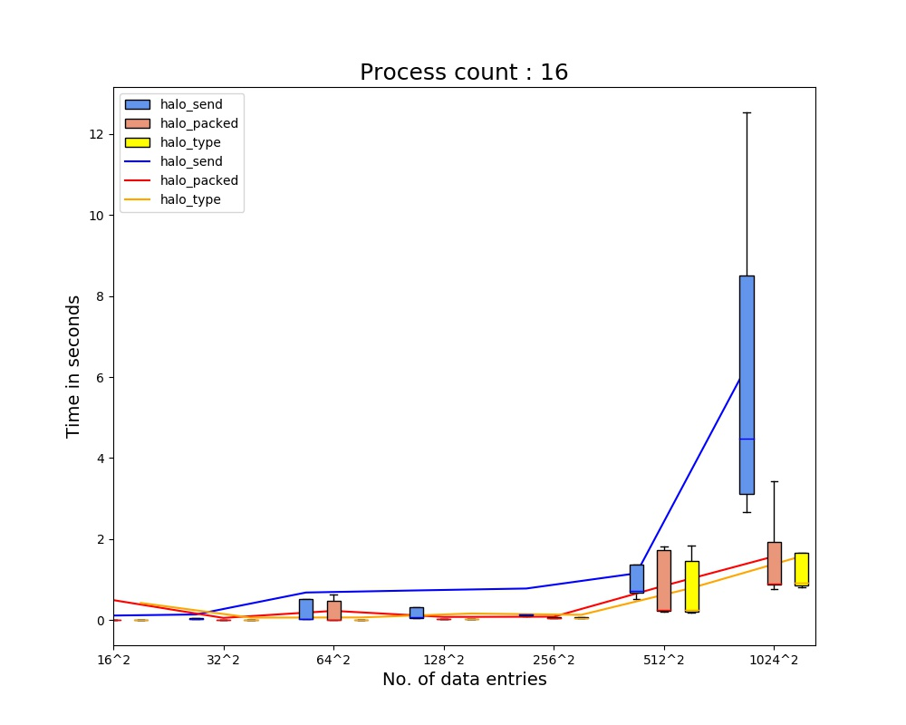
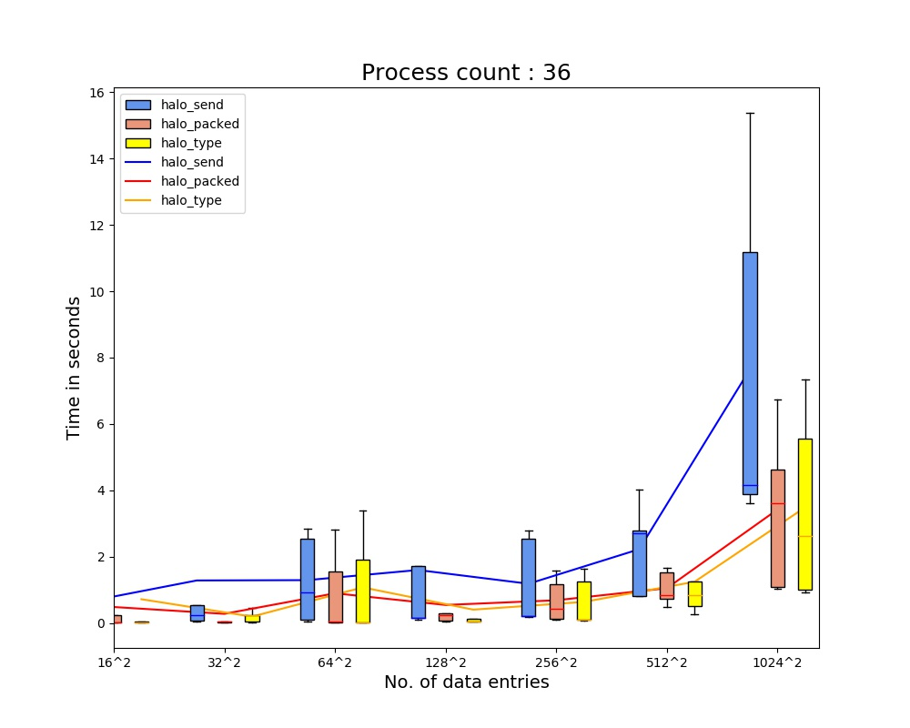
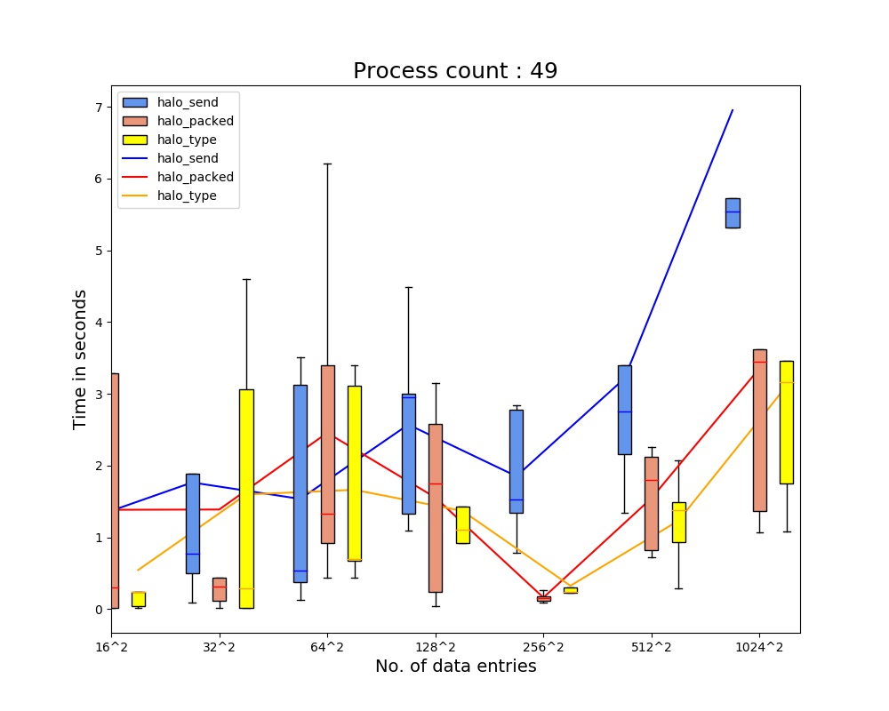
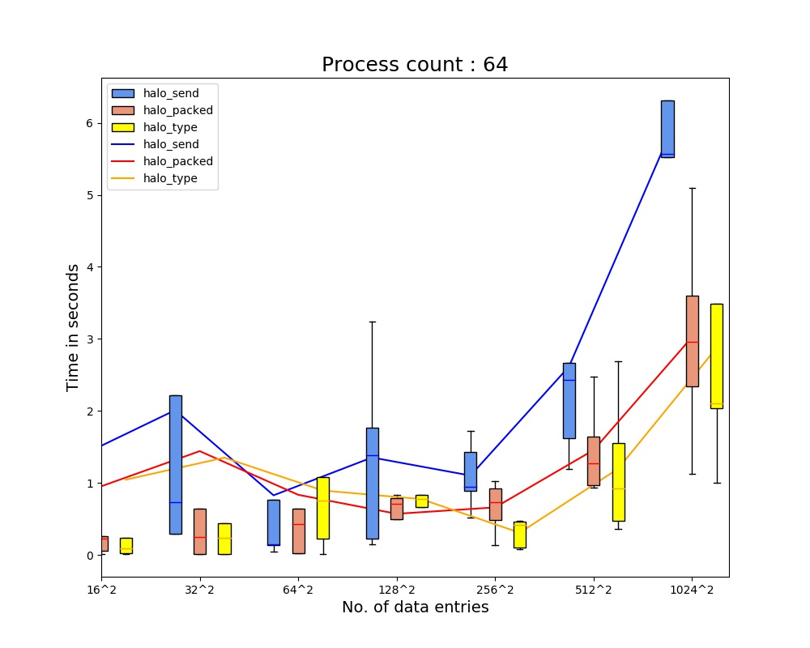

# Assignment 1

### How to run

```
python3 run.py
```

### The folder contains the files:
1. run.py : allocates nodes and runs src.c for each N,P 5 times, generates the data files
2. plot.py : generates 4 plots corresponding to the process counts [16,36,49,64]
3. Makefile : compiles src.c
4. src.c : contains the source code

### Code
Halo exchange functions 

```C
double halo_send(double** arr, int rank, int size)
double halo_packed(double** arr, int rank, int size)
double halo_type(double** arr, int rank, int size)
```
1. arr : pointer to process' copy of 2D data array
2. rank : process rank in MPI\_COMM\_WORLD
3. size : total number of processes in MPI\_COMM\_WORLD

```C
double halo_send(double** arr, int rank, int size)
```
- Performs halo exchange via multiple MPI\_Sends, each MPI\_Send transmits 1 double. 

```C
double halo_packed(double** arr, int rank, int size)
```
- Use of MPI\_Pack to pack data of one row(Top/Bottom) or column(Left/Right) into a buffer(*send\_buff*) to send data to the respective neighbouring processes.
- Data is received in *recvp\_buff*. MPI_Unpack used to store the data in *recv\_buff*.

```C
double halo_type(double** arr, int rank, int size)
```
- Use of MPI\_Type\_vector to create *coltype*
- Use of MPI\_Type\_contiguous to create *rowtype*
- For sending data from a column(Left/Right exchange) *coltype* is used.
- For sending data from a row(Top/Bottom exchange) *rowtype* is used.

#### Common logic in all methods: 
- The processes are assumed to form an abstract square grid.
- Processes (i\*p, i\*p + p-1) form the i th row, where *p = sqrt(P)* and *P* is total number of processes.  
- All the three methods send/receive data from 4 directions in the given order: 
    Left -> Right -> Top -> Bottom
- If the process happens to be at a boundary, it does not send to/receive from the boundary direction. 
- Received data is stored in *recv\_buff* which is used to compute data for next time step by *avg\_compute*. 
- Data recieved from neighbour processes is stored in *recv\_buff* in clockwise direction starting from Left neighbour. 
  e.g. recv\_buff[0] -> left neighbour, recv\_buff[1] -> top neighbour ... 

```C
void avg_compute(int s, int pcol, int prow, double** arr, double** recv_buff)
```
1. s: s = sqrt(size), where size is total number of processes in MPI\_COMM\_WORLD
2. pcol: x-coordinate of process in process grid.
3. prow: y-coordinate of process in process grid. 
4. arr: double\*\* pointer to process' copy of data.
5. recv_buff: double\*\* pointer to 4 x n (where n = sqrt(N), N=data size) array used to store received data.

#### Global variables
1. n: n = sqrt(N) where N=data size
2. num_time_steps: Total number of time steps for which halo exchange is performed. 
3. rowtype: MPI\_Type\_vector for sending rows
4. coltype: MPI\_Type\_contiguous for sending columns

### Observations
We generate 4 plots corresponding to each process count.
The plot contains three line graphs respectively for halo\_send(blue), halo\_packed(red) and halo\_type(orange) indicating mean execution time for 5 iterations. 
These line graphs are generated using the mean of the 5 execution times for each N,P.
For a particular no. of data entries(N), the boxplots are created using the 5 data points generated by 5 independent executions of the communication function.

- We observe that the execution time of halo\_send is invariably more than that of halo\_packed and halo\_type for fixed P,N.
- Time taken for all three methods increases with the number of processes keeping data size fixed. 
- Execution time for all three methods increases with the increase in data size.
- The increase in time for any fixed number of processes and fixed communication method (change in slope of line graph) is sharpest when going from 256^2 to 512^2 and/or 512^2 to 1024^2. 

### Problems faced
- For large data size (>=1024^2) the program gave segmentation fault upon static allocation of data and buffers due to the stack size limit of 8 MB. This issue was resolved by allocating large buffers dynamically using malloc. 
- Installation of external libraries (Psutil, Numpy, Matplotlib) failed several times probably due to network issues on certain machines on the cluster. 
- Long run times on several occasions probably due to high load on certain machines. Resolved to some extent by removing csews1-10 from ~/.eagle/hosts.txt.

### Plots
<div><center><center></div>
<div><center><center></div>
<div><center><center></div>
<div><center><center></div>
