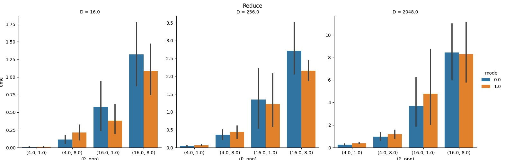

# Assignment 2

### How to run

```
python3 run.py
```

### The folder contains the files:
1. run.py : creates the hostfile using script.py and runs src.c for each configuration, generates the plots for all 4 collectives
2. script.py : creates the hostfile using information from nodefile.txt
3. nodefile.txt : contains csews cluster information required by script.py
3. Makefile : compiles src.c
4. src.c : contains the implementation of optimized collective functions based on the topology of *csews* cluster

### Code
Helper Functions:

```C
int get_my_node()
int get_my_group(int node)
double get_arrays(int root)
double get_comms(int root, int* is_node_leader, int* is_group_leader)
void Operation(MPI_Op op, double *itmd_buf, double *sendbuf, int count)
```
1. get\_my\_node() : returns which node the process runs on based on hostname
2. get\_my\_group() : returns group no. based on node
3. get\_arrays(int root): for each process, creates the arrays node_ranks, node_leaders and group_leaders
  - node_ranks: array of all ranks on the corresponding node 
  - node_leaders: array of node_leaders on the corresponding group
  - group_leaders: array of group_leaders
4. get\_comms(int root, int\* is\_node\_leader, int\* is\_group\_leader): creates the subcommunicators for the three levels of communication i.e. node level (*node_comm*), group level (*nl\_comm*) and global (*gl\_comm*) depending on whether the calling process is a node_leader or group\_leader
5. Operation(MPI\_Op op, double \*itmd\_buf, double \*sendbuf, int count): given two buffers, this function applies the *op* operation on each element of the two arrays and returns the updated value in sendbuff.

Optimized Collective Functions:

```C
int MPI_Bcast_optimised(void* buffer, int count, MPI_Datatype datatype, int root, MPI_Comm comm, int is_node_leader, int is_group_leader)
```

```C
int MPI_Reduce_optimised(void* sendbuf, double *recvbuf, int count, MPI_Datatype datatype, MPI_Op op, int root, MPI_Comm comm)
```

```C++
int MPI_Gather_optimised(const void *sendbuf, int scount, MPI_Datatype stype, void *recvbuf, int rcount, MPI_Datatype rtype, int root, int* allranks, int is_node_leader, int is_group_leader)
```

```C++
int MPI_Alltoallv_optimised(const void* sendbuff, const int* send_counts, const int* send_displs, MPI_Datatype stype, void* recv_buff, const int* recv_counts, const int* recv_displs, MPI_Datatype rtype);
```

### Heirarchy and Assumptions

#### Heirarchy
1. The processes are in a 3 level heirarchy of group leaders, node leaders, and nodes.
2. For each process we find which node and group it belongs to, thus finding the corresponding arrays for ranks in the node(node\_ranks), node\_leaders in the group(node\_leaders), and the overall group leaders(group\_leaders)
3. We have 3 subcommunicator levels: node\_comm(corresponding to node\_ranks), nl\_comm(corresponding to node\_leaders) and gl\_comm(corresponding to group\_leaders) 
4. This is to mitigate inter-node and inter-group communication overheads. Thus, all nodes communicate with their node leaders, all node leaders communicate with their group leaders and the group leaders communicate with the root. We maintain that the root(wherever applicable) is always the node leader and group leader for its corresponding node and group.
5. We have added a check for no of groups. If no of groups is 1, we do not create gl\_comm.

<div><center><center></div>

#### Assumptions 

Optimised collective functions assume the following:
1. Root is known before hand and remains the same for all the 5 iterations. (MPI\_Bcast, MPI\_Reduce, MPI\_Gather)
2. Consequently we can reuse the communicators that have been created for nodes, node leaders and group leaders.
(Please Note that this condition can be relaxed by using a single MPI_Send from root to the respective node leader. )
3. The communicator used for the collective calls is MPI\_COMM\_WORLD in all cases. (MPI\_Bcast, MPI\_Reduce, MPI\_Gather, MPI\_Alltoallv)
4. The send buffer is contiguous. (MPI\_Alltoallv)
(This assumption can be relaxed, this has been discussed in the next section.)

It shall be noted that the time for extra commmunicator creation (n\_comm, nl\_comm and/or gl\_comm) has been included as overhead.  

### Optimisations

#### Bcast
1. Binomial Implementation: [This can be found in bcast.c]
  -  At each level of heirarachy we carry out the communication in binomial fashion (as depicted in the diagram).
  - Thus, the root sends data to group leaders using MPI\_Isend/MPI\_Irecv, group leaders to node leaders and finally node leaders to all ranks in their nodes.
  - This implementation relieves us of subcommunicator creation overheads. 
  - Significant performance improvement can be observed for small data sizes [approx. 5 times]. 

2. Bcast with subcommunicators: [We have used this implementation for plot generation]
  - Root sends data to the group leaders in gl\_comm communicator using stanard Bcast. Thereafter, group leaderes send data to the node leaders in nl\_comm and node leaders send data to all processes(ranks) in node\_comm, all using standard Bcast.
  - This performs consistently well for all data sizes.


#### Reduce
1. Binomial Implementation: [We have used this implementation for plot generation]
  - Starting at node level, binomial reduce is carried out within node to find the reduced value of data at the node leaders.
  - This is done by sending data to respective parent using MPI\_Send/MPI\_Recv. Using helper function *Operation(MPI_Op op, double \*itmd_buf, double \*sendbuf, int count)*, the required reduced value is calculated and passed on to further levels. This way the node leaders get the final reduced value for a node.
  - The same method is carried out at nl\_comm and gl\_comm levels. 
  - The root gets the final reduced value through group\_leaders.
  - This method optimises reduce significantly for small data sizes. Time reduction by a factor of approx 3 for small data sizes. Optimization is good for large data sizes as well.

2. Reduce with subcommunicators:
  - Perform standard reduce at each level of communication, starting at node level using n\_comm.
  - Reduced data from node leaders is further reduced at group level using  nl\_comm. Similarly, the root gets final reduced value using gl\_comm.
  - The performance is comaparable to standard reduce and mostly better.

[This comaparison script can be found in reduce-compare.c]
<div><center><center></div>

#### Gather
1. Gather with subcommunicators:
  - Perform standard gather at each level of communication, starting at node level using n\_comm. 
  - Gather process ranks in to comm at each level of communication to rearrange data at root. 
  - The performance is comparable to standard reduce. 


#### Alltoallv
1. Alltoallv with subcommunicators:
  - Starting at node level, the node leader gathers send\_buff and send\_counts from all ranks in the n\_comm using MPI\_Gatherv.
  - Using send_counts information, node leader rearranges data to place data outgoing to same rank contiguously.
  - Node Leaders exchange data going to their nodes using MPI\_Alltoallv. 
  - Node Leaders again rearranges the data. 
  - Node Leaders sends data to respective ranks within the node using MPI\_Scatterv. (see fig for better visualisation)
  - All ranks then copy recieved data into recieve buffer at appropriate offsets. 
  - This method optimises alltoallv significantly for large number of processes (given enough processes per node.)
  - Assumption 4. has been used in gather step. Non leader processes simply send the complete send buffer instead of copying data from provided offsets. This assumption can be done away with by just copying relevant parts of send buffer into a new buffer and use this buffer for MPI\_Gatherv, without adding much overhead. 
  
<div><center><center></div>
<div><center><center></div>

### Performance Analysis
For all plots: mode 0 is optimised version of collective and mode 1 is default.

#### Bcast 
- Performance is almost comparable for small data size. Optimisation performance improves with increase in data size.
- Performance does not change much with change in number of processes or ppn.
<div><center><center></div>

#### Reduce
- Performance is significantly better for small data sizes and comparable for large data sizes
- With increased no of groups, the optimized code performs slightly worse. Else, optimization can be seen.

<div><center><center></div>

#### Gather 
- Performance is mostly comparable. No improvement can be seen. 
- Only improvement is for data size with many groups having large ppn
<div><center><center></div>

#### Alltoallv
- Performance for optimised version improves significantly with increase in number of processes. 
- Performance gap increases with increase in data size.
- Performance gap significantly increases with number of processes per node. 
<div><center><center></div>