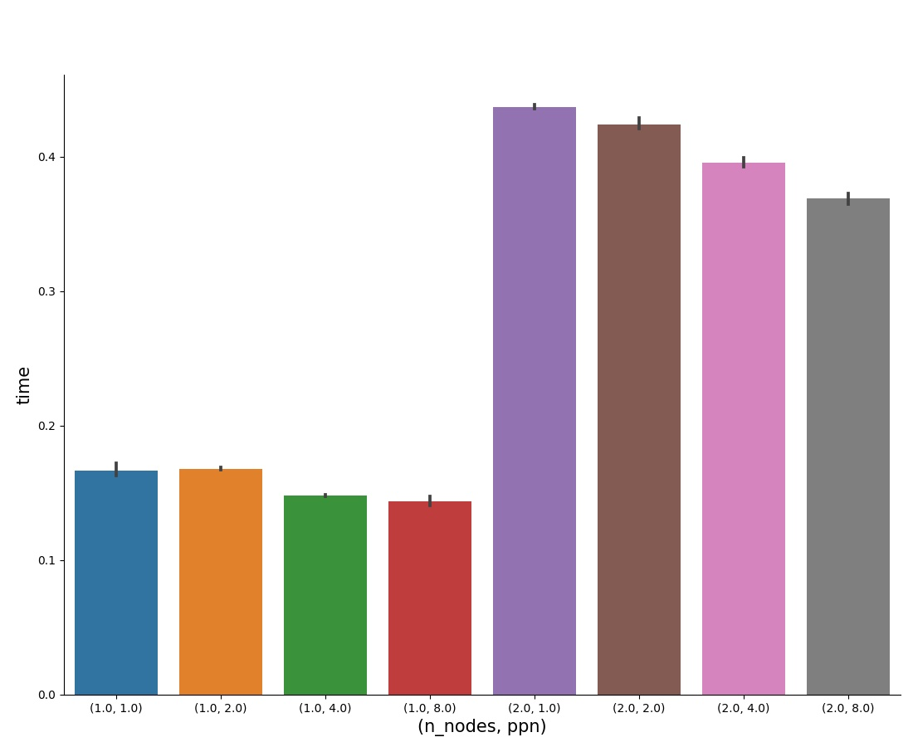
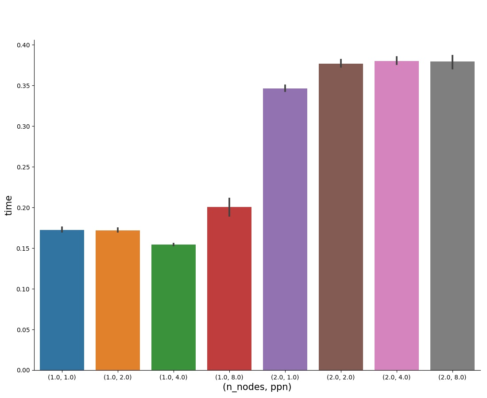
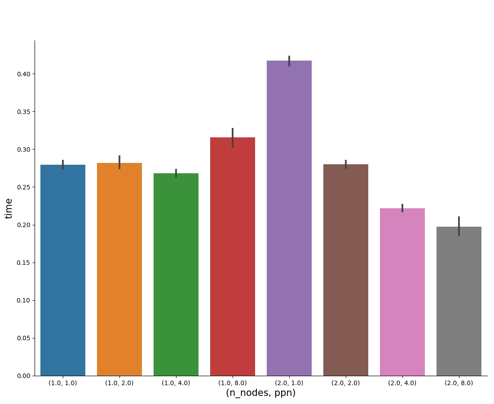
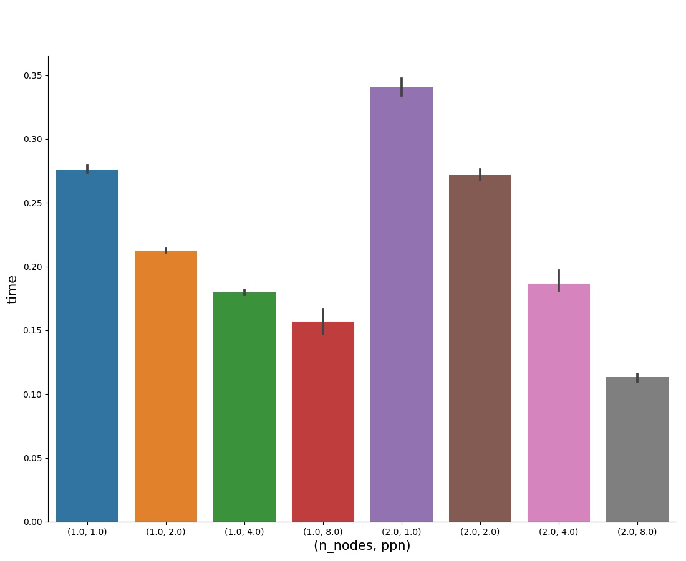

# Assignment 3

### How to run

```bash
python3 run.py <path to file>
```

### The folder contains the files:
1. run.py : creates the hostfile using script.py and runs src.c for each configuration, generates 1 plot, a data.csv file and output.txt
2. script.py : creates the hostfile using information from nodefile.txt
3. nodefile.txt : contains csews cluster information required by script.py
3. Makefile : compiles src.c
4. src.c : Contains implementation of program to distribute computation of minimum temperatures.

### Code

#### Data collection

As we are not to make any assumption about the number of rows and columns, the data is first read into a linked list of blocks that contain 1 row each from the input data file.

```c++
typedef struct TempList{
   char* line;             // one row of input file
   int size;               // number of bytes in the line
   struct TempList* next;  // pointer to next block in linked list
}Templist;
```
Once we have read all the data, we have the number of rows and columns. So a contiguous chunk of memory of size M\*N (M is the number of Years/columns, N is the number of stations/rows) is allocated for creating the data array and populated by going over the recorded linked list.

#### Data distribution

As the number of stations(rows) might be huge, it is logical to divide it along this dimension. We tried doing this division by 2 approaches.
1. Data is divided equally among all processes
2. Data is divided unequally based on process ranks

##### Equal Distribution of Data

In approach 1, some processes might stay idle for a long time waiting for their corresponding receive, while other processes are busy communicating the data. This works very poorly when the number of nodes is 2 due to considerable communication bottlenecks. With 1 node as well, there isn’t much improvement.
[Code can be found in data_equal.c]

<div><center></br><h4>Uniform Distribution</h4><center></div>

##### Unequal Distribution of Data

To mitigate the idle time in processes, approach 2 divides data unequally such that the processes receiving the data earlier are processing a larger volume of it.

We have tried 2 division strategies for above -
1. Data received by every process is proportional to the size of the binomial tree rooted at that process (assuming root is 0, a binomial scatter algorithm will form a sort of binomial tree.)
[Code can be found in data_weighted.c]

2. Data is divided into the 2 nodes in some ratio. Then the data is distributed equally among all processes on that node.

As the communication time inside a node is not very significant as compared to communication time across nodes, approach 2 works better when there are multiple nodes as we have to send only a small volume of data to the second node.

- If only approach 1 is used, we get results as shown in figure 1. The performance improves with increase in number of processes in the node when we have 1 node but detoriates when there are 2 nodes. 

<div><center></br><h4>Figure 1</h4><center></div>

- If only approach 2 is used, we get results as shown in figure 2. Performance remains uniform when there is just one node. It improves when there are 2 nodes and the number of processes per node increases. 

<div><center></br><h4>Figure 2</h4><center></div>

We have used a hybrid of the 2 approaches. If there is just one node, approach 1 above is used. If there are 2 nodes, approach 2 is used. 

```c++
float Scatter_binomial_one_node(float* data, long M, long N, float* minima);
```

```c++
float Scatter_binomial_two_node(float* data, long M, long N, float* minima);
```

- These functions use binomial tree algorithm for scattering the data to the given processes (assuming the number of processes is a power of 2). 
- We have used Isends to send data and all the required computation on data is done in this function itself (after posting send requests) so that the computation can be done concurrently with communication. 
- All the local minima for the years are stored in the array “minima”. After every process has computed its copy of minima, we use MPI\_Ireduce on minima to get the global minimum values for every year. 
- Both return the local minimum of temperature across all years. Another MPI\_Reduce is used to get the global minimum of temperatures across all years. 
- *Scatter\_binomial\_one\_node* is used when there is exactly one node. This function uses division strategy 2(1) for dividing data proportionally to the processes on the node. 
- *Scatter\_binomial\_two\_node* is used when there are 2 nodes (it can be extended to multiple nodes). This function uses division strategy 2(2) for dividing data proportionally to the processes on the node. 

#### Helper Function

```c++
int get_my_node();
```
This function return the node number of the current process. (eq. 13 for csews13)

### Observations 

<div><center></br><h4>Combined</h4><center></div>

1. Trying approach 2 we found that for ratio size^2 - 1 : 1, we get a significant performance boost. This happens because the communication time across nodes is pretty large whereas computation time is insignificant. As we increase the ratio we keep getting better performance especially for 2 nodes with 8 processes per node.

2. As the amount of computation is very small (only 1 floating point comparison per data point), communication time becomes bottleneck quite easily. Thus there is only slight improvement in computation times for 2 and 4 number of processes.

3. For 2 nodes and 1 process per node, the computation time actually goes up. 
